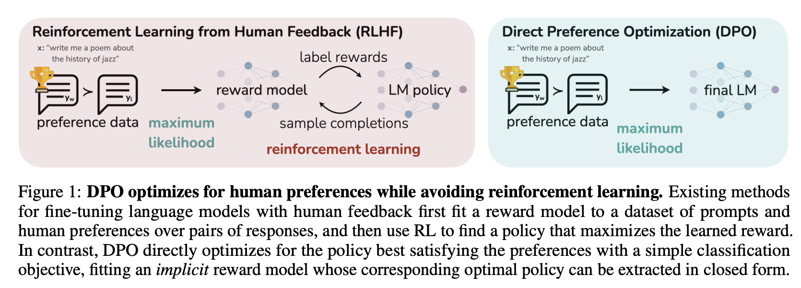
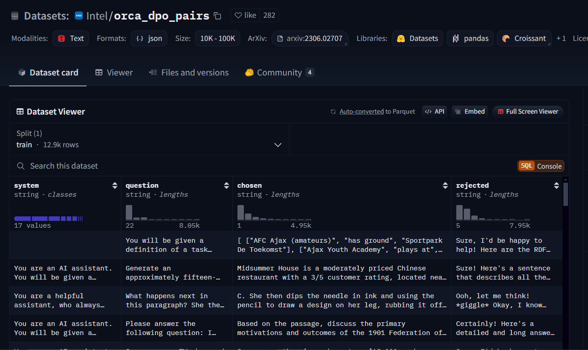

# Direct Preference Optimization (DPO):

## Background:

Through Finetuning, we can utilize some pre-trained base LLMs (next-token predictor models) to answer questions and answers and acts as helpful assitants. However, finetuned LLMs can be toxic, harmful and biased etc., To address this problem, RLHF(Reinforcement Learning from Human Feedback) comes into play.

In RLHF, there is a concept of **reward functions**, and we train models to make decisions that _maximize rewards_, making their outcomes more accurate. Human feedback is incorporated into these rewards function, so the ML model can perform tasks more aligned with human goals, wants, and needs by maximizing reward-scores.

RLHF has enabled language models to begin to align a model trained on a general corpus of text data to that of complex human values.

> For more in-depth information, visit [Illustrating Reinforcement Learning from Human Feedback (RLHF) from HF](https://huggingface.co/blog/rlhf)

## Introduction

RLHF is a complex and often _unstable procedure_, first fitting a reward model that reflects the human preferences, and then _fine-tuning_ the large unsupervised LM using reinforcement learning to maximize this estimated reward without drifting too far from the original model. So, consider the **Implementation Complexity**, **Computational Overhead** and **Locus of Control**, a new parameterization of reward model that solves the standard RLHF problem with **only a simple classification loss**.

DPO is stable, performant, and computationally lightweight, eliminating the need for sampling from the LM during fine-tuning or performing significant hyperparameter tuning.

> DPO is able to bypass both fitting an explicit reward and performing RL to learn the policy using a single maximum likelihood objective.

- [📄 Direct Preference Optimization: Your Language Model is Secretly a Reward Model](https://arxiv.org/abs/2305.18290)

## How DPO works

Fine-tuning a language model via DPO consists of two steps:

- **Data collection**: Gather a preference dataset with positive and negative selected pairs of generation, given a prompt.
- **Optimization**: Maximize the log-likelihood of the DPO loss directly.

> DPO-compatible datasets can be found with the tag dpo on Hugging Face Hub. You can also explore the librarian-bots/direct-preference-optimization-datasets Collection to identify datasets that are likely to support DPO training.

### Dataset Format

Since the model will be trained to directly optimize the preference of which sentence is the most relevant, given two sentences, so considering this, following dataset format is required to finetune via DPO as:

These datasets always have at least three columns `prompt`, `chosen`, `rejected`

> **NOTE**: You can always customize your prompt according to the dataset column (See [Llama3-8B-SuperNova-Spectrum-Hermes-DPO.ipynb])

## Setup

### Dataset

I have crafted 2K dataset sample named [yuvraj17/chatml-OpenHermes2.5-dpo-binarized-alpha-2k](https://huggingface.co/datasets/yuvraj17/chatml-OpenHermes2.5-dpo-binarized-alpha-2k) from Maxime Labonne's 10K DPO dataset [mlabonne/chatml-OpenHermes2.5-dpo-binarized-alpha](https://huggingface.co/datasets/mlabonne/chatml-OpenHermes2.5-dpo-binarized-alpha), by filtering out on the top 2K rows on `delta_score` column.

### TRL

In this DPO experiment, I have used `Huggingface TRL's` **DPOTrainer** to DPO finetune my `DARE_TIES` merged Model [`yuvraj17/Llama3-8B-SuperNova-Spectrum-dare_ties`](https://huggingface.co/yuvraj17/Llama3-8B-SuperNova-Spectrum-dare_ties).

> The setup incorporates **QLoRA** in `4-bit precision` with **`nf4` quantization** for making the training memory efficient, for 1 epoch.

### GPU Setup

I have performed this DPO fine-tuning on Rupod GPUs.

**GPU-Used:**

- 1 x A40 (48GB VRAM)
- A Jupitor Notebook with all the DPO code added. Just mount it, set your environment variables, and Start Finetuning.

### Weight & Biases Report

[Report-Link](https://api.wandb.ai/links/my-sft-team/d211juao)

## Result

- A DPO Tuned version of my `DARE_TIES` merged Model [`yuvraj17/Llama3-8B-SuperNova-Spectrum-dare_ties`](https://huggingface.co/yuvraj17/Llama3-8B-SuperNova-Spectrum-dare_ties)

**[yuvraj17/Llama3-8B-SuperNova-Spectrum-Hermes-DPO](https://huggingface.co/yuvraj17/Llama3-8B-SuperNova-Spectrum-Hermes-DPO)**

> Visit, Try-out & Drop your thoughts..

## Next-up:

- Quantize the Model (GGUF, GPTQ or AWQ) for local inference.
- Evaluation on Nous and OpenLLM Benchmarks

---

Get in touch

