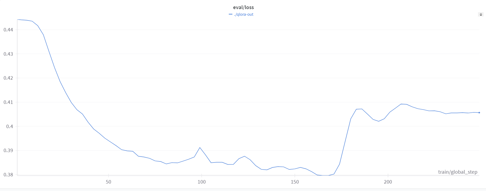
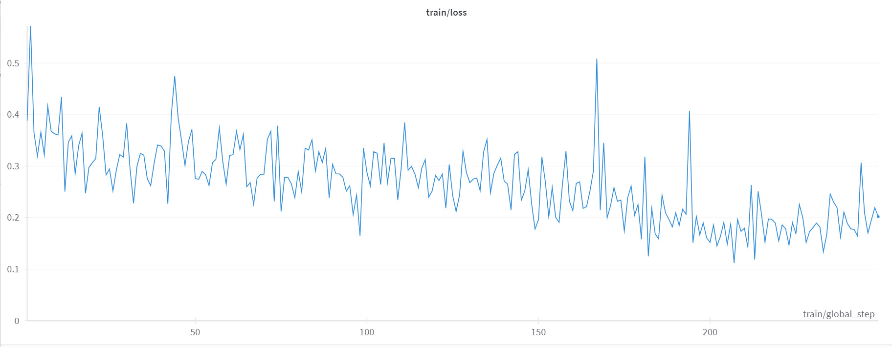

# Meta-Llama-3.1-8B-Instruct Qlora finetune using `Axolotl`

For the reference of `EvolCodeLlama-3.1-Instruct.yaml` file, visit this excellent [blog post](https://mlabonne.github.io/blog/posts/A_Beginners_Guide_to_LLM_Finetuning.html) by `mlabonne`.

Using my updated yaml file, I have created a fine-tuned version of the LLaMA-Model `meta-llama/Meta-Llama-3.1-8B-Instruct`, fine-tuned on the dataset of [`mlabonne/Evol-Instruct-Python-1k`](https://huggingface.co/datasets/mlabonne/Evol-Instruct-Python-1k), which contains 1K python-examples, a subset of [nickrosh/Evol-Instruct-Code-80k-v1](https://huggingface.co/datasets/nickrosh/Evol-Instruct-Code-80k-v1) dataset.

## Getting Started

I have performed my fine-tuning on Rupod GPUs.

**GPU-Used:**

- 1 x A40 (48GB VRAM)
- 9 vCPU 50 GB RAM

### Downloading Dependencies:

```
pip3 install torch==2.4.0 torchvision torchaudio --index-url https://download.pytorch.org/whl/test/cu121
git clone https://github.com/OpenAccess-AI-Collective/axolotl
cd axolotl
pip install xformers
pip install packaging ninja
pip install -e '.[flash-attn,deepspeed]'
```

### HuggingFace and Wandb Authentication:

```
huggineface-cli login
```

```
pip install wandb
wandb login
```

### Performing Fine-tuning:

1. Get the axolotl yaml configuration file

```
wget https://raw.githubusercontent.com/yuvrajsagar17/axolotl-finetune/main/EvolCodeLlama-3.1-8B-Instruct.yaml

```

2. Start Fine-tuning:

```
accelerate launch scripts/finetune.py EvolCodeLlama-3.1-8B-Instruct.yaml

```

This will start our fine-tuning of the base-model(`meta-llama/Meta-Llama-3.1-8B-Instruct`).
**Training-Time:** A little bit more than 1 hour.

**Training/Loss Curve:**





### Merging QLoRa adapters

After successfully completing the fine-tuning, the _QLoRA adapter_ should already be uploaded to the Hugging Face Hub. In order to merge our base-model with these adapters, and pushing our merged model to HuggingFace, the steps are as:

1. Using this [script](https://gist.github.com/mlabonne/a3542b0519708b8871d0703c938bba9f) by `mlabonne`

```
wget https://gist.githubusercontent.com/mlabonne/a3542b0519708b8871d0703c938bba9f/raw/60abc5afc07f9d843bc23d56f4e0b7ab072c4a62/merge_peft.py
```

2. Executing the script:

```
python merge_upload.py --base_model="meta-llama/Meta-Llama-3.1-8B-Instruct" --peft_model="./qlora-out" --hub_id="EvolCodeLlama-3.1-8B-Instruct"
```

This will upload the merged model as `EvolCodeLlama-3.1-8B-Instruct` on your HuggingFace Hub.
For reference, see my Model [yuvraj17/EvolCodeLlama-3.1-8B-Instruct](https://huggingface.co/yuvraj17/EvolCodeLlama-3.1-8B-Instruct)

### Next-up:

- Quantize the Model (GGUF, GPTQ or AWQ) for local inference.

---

♥ Special Thanks to

- [Maximme labonne](https://github.com/mlabonne) for his beginner friendly blog on using **axolotl** [A Beginner’s Guide to LLM Fine-Tuning](https://mlabonne.github.io/blog/posts/A_Beginners_Guide_to_LLM_Finetuning.html) & the [`merge_peft`](https://gist.github.com/mlabonne/a3542b0519708b8871d0703c938bba9f) script for merging qlora-adpaters after finetuning.
- [Axolotl Team](https://github.com/axolotl-ai-cloud/axolotl) for such an easy-to-use tool for PEFT
