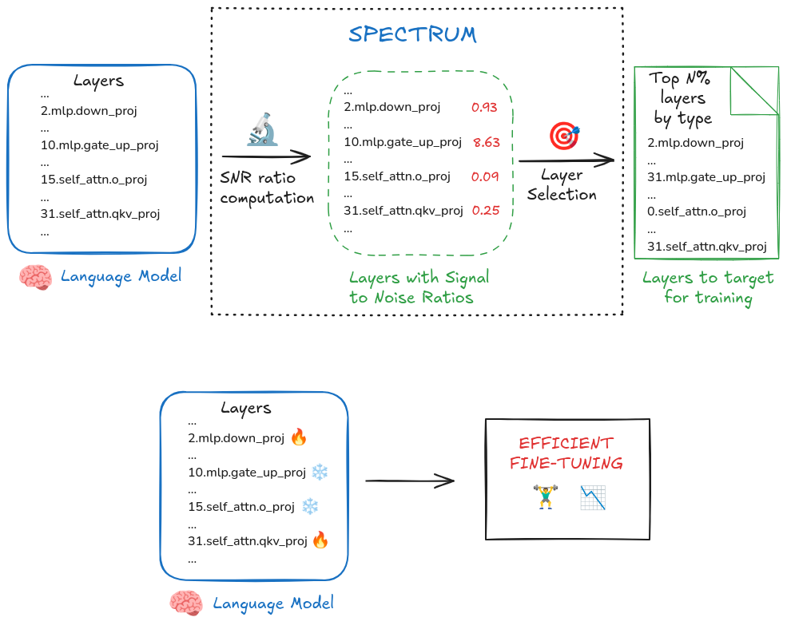
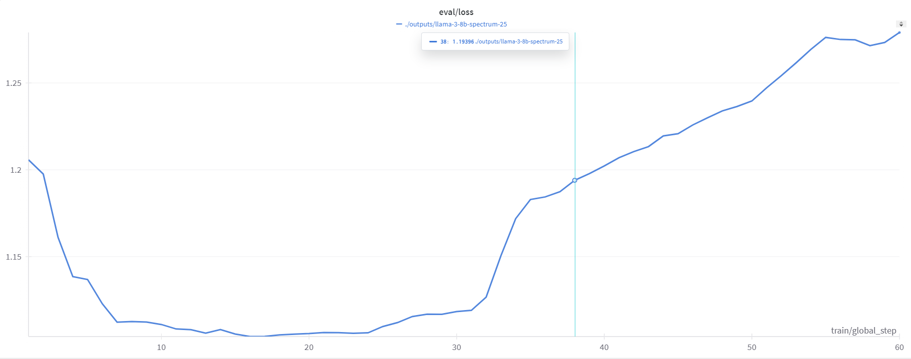
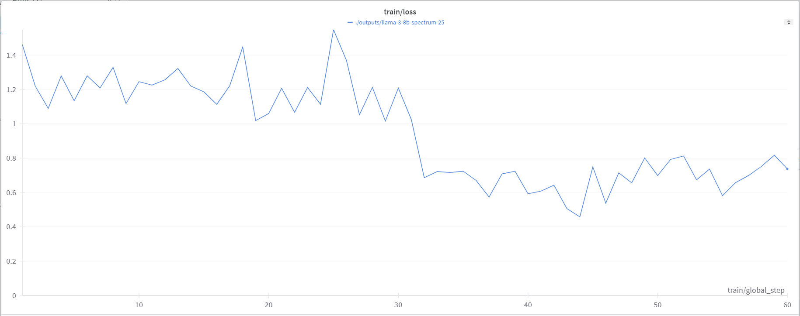

# Spectrum: Targeted Training on Signal to Noise Ratio

## Introduction:

Efficiently finetuning LLMs remains a challenging task due to the vast computational resources required. To address this, Spectrum, a method that accelerates LLM training by selectively targeting layer modules based on their signal-to-noise ratio (SNR), and _freezing the remaining modules_, was introduced by [Eric Hartford et. al 2024](https://arxiv.org/abs/2406.06623).

In this approach, an algorithm is used to calculate SNR values prior to training that selectes **t%** of the model-layers with highest SNR values, that are the most informative layers in the model. For SNR Calculations, Authors have used Random-Matrix Theory Marchenko-Pastur distribution to distinguish signal from noise, and based on the percentage choice _(t)_, Spectrum selects the most informative layers of each type.

> **The key goal of Spectrum Fine-tuning is:** _minimize the memory footprint and accelerate LLM training without sacrificing performance_.

In the paper, authors have selected two values for **t**, either _25_ or _50_ to compare its performance and compute requirements with existing finetuning techniques.

> I have decided to choose `t=25`, since it requires minimum computation for fine-tuning

For in-depth details how Spectrum works, [this](https://huggingface.co/blog/anakin87/spectrum) community article on Spectrum can be very helpful.


> Refrence: [Huggingface Community Blog](https://huggingface.co/blog/anakin87/spectrum) 

## Getting Started

I have performed my fine-tuning on Rupod GPUs.

**GPU-Used:**

- 2 x A40 (48 GB VRAM)

I have finetuned of `meta-llama/Meta-Llama-3-8B-Instruct` on the `yuvraj17/finetune_alpaca_1K dataset`. Utilizing the `Llama-3-8B-spectrum.yaml` axolotl yaml file with distrubuted training using `deepspeed zero2_config.json`

### Setup and configuration:

### Downloading Dependencies:

```
pip3 install torch==2.4.0 torchvision torchaudio --index-url https://download.pytorch.org/whl/test/cu121
git clone https://github.com/OpenAccess-AI-Collective/axolotl
cd axolotl
pip install xformers
pip install packaging ninja
pip install -e '.[flash-attn,deepspeed]'
```

### HuggingFace and Wandb Authentication:

```
huggineface-cli login
```

```
pip install wandb
wandb login
```

### Performing Fine-tuning:

1. Clone Spectrum Repositoty from [GitHub](https://github.com/cognitivecomputations/spectrum) and identify your target layers for finetuning

```

git clone https://github.com/cognitivecomputations/spectrum.git
cd spectrum
pip install -r requirements.txt

```

2. To use Spectrum, run the following command:

```
python spectrum.py --model-name <insert local or HF repo here> --top-percent <top % of snr ratios to target>
```

In my case, it will be: 
```
python spectrum.py --model-name meta-llama/Meta-Llama-3-8B-Instruct --top-percent 25
```

So, at this moment, you will have your **25%** target layers, on which you have to finetune your Model.

<details>
  <summary>25% SNR Values for LLama3-8B-Instruct</summary>

```
  - ^lm_head.weight$
  - ^model.embed_tokens.weight$
  # input_layernorm layers
  - model.layers.0.input_layernorm
  - model.layers.1.input_layernorm
  - model.layers.2.input_layernorm
  - model.layers.3.input_layernorm
  - model.layers.4.input_layernorm
  - model.layers.5.input_layernorm
  - model.layers.6.input_layernorm
  - model.layers.7.input_layernorm
  # lm_head layers
  # mlp.down_proj layers
  - model.layers.1.mlp.down_proj
  - model.layers.0.mlp.down_proj
  - model.layers.2.mlp.down_proj
  - model.layers.30.mlp.down_proj
  - model.layers.22.mlp.down_proj
  - model.layers.21.mlp.down_proj
  - model.layers.5.mlp.down_proj
  - model.layers.29.mlp.down_proj
  # mlp.gate_proj layers
  - model.layers.1.mlp.gate_proj
  - model.layers.2.mlp.gate_proj
  - model.layers.3.mlp.gate_proj
  - model.layers.0.mlp.gate_proj
  - model.layers.4.mlp.gate_proj
  - model.layers.25.mlp.gate_proj
  - model.layers.26.mlp.gate_proj
  - model.layers.5.mlp.gate_proj
  # mlp.up_proj layers
  - model.layers.4.mlp.up_proj
  - model.layers.0.mlp.up_proj
  - model.layers.3.mlp.up_proj
  - model.layers.5.mlp.up_proj
  - model.layers.7.mlp.up_proj
  - model.layers.6.mlp.up_proj
  - model.layers.2.mlp.up_proj
  - model.layers.1.mlp.up_proj
  # model.embed_tokens layers
  # model.norm layers
  # post_attention_layernorm layers
  - model.layers.0.post_attention_layernorm
  - model.layers.1.post_attention_layernorm
  - model.layers.2.post_attention_layernorm
  - model.layers.3.post_attention_layernorm
  - model.layers.4.post_attention_layernorm
  - model.layers.5.post_attention_layernorm
  - model.layers.6.post_attention_layernorm
  - model.layers.7.post_attention_layernorm
  # self_attn.k_proj layers
  - model.layers.29.self_attn.k_proj
  - model.layers.25.self_attn.k_proj
  - model.layers.23.self_attn.k_proj
  - model.layers.28.self_attn.k_proj
  - model.layers.21.self_attn.k_proj
  - model.layers.19.self_attn.k_proj
  - model.layers.22.self_attn.k_proj
  - model.layers.20.self_attn.k_proj
  # self_attn.o_proj layers
  - model.layers.14.self_attn.o_proj
  - model.layers.7.self_attn.o_proj
  - model.layers.5.self_attn.o_proj
  - model.layers.11.self_attn.o_proj
  - model.layers.9.self_attn.o_proj
  - model.layers.6.self_attn.o_proj
  - model.layers.13.self_attn.o_proj
  - model.layers.10.self_attn.o_proj
  # self_attn.q_proj layers
  - model.layers.13.self_attn.q_proj
  - model.layers.9.self_attn.q_proj
  - model.layers.10.self_attn.q_proj
  - model.layers.8.self_attn.q_proj
  - model.layers.14.self_attn.q_proj
  - model.layers.11.self_attn.q_proj
  - model.layers.0.self_attn.q_proj
  - model.layers.15.self_attn.q_proj
  # self_attn.v_proj layers
  - model.layers.26.self_attn.v_proj
  - model.layers.17.self_attn.v_proj
  - model.layers.28.self_attn.v_proj
  - model.layers.3.self_attn.v_proj
  - model.layers.29.self_attn.v_proj
  - model.layers.21.self_attn.v_proj
  - model.layers.16.self_attn.v_proj
  - model.layers.15.self_attn.v_proj
```

</details>

Add your layer modules in your axolotl config file under `unfrozen_parameters` arg. [see here](https://github.com/yuvrajsagar17/axolotl-finetune/blob/main/spectrum/Llama-3-8B-spectrum.yaml#L26)

3. Get the axolotl yaml configuration file

```

wget https://raw.githubusercontent.com/yuvrajsagar17/axolotl-finetune/refs/heads/main/spectrum/Llama-3-8B-spectrum.yaml

```

4. Start Fine-tuning:

```

accelerate launch scripts/finetune.py Llama-3-8B-spectrum.yaml

```

This will start our fine-tuning of the base-model(`meta-llama/Meta-Llama-3.1-8B-Instruct`).

### Training Parameters

```
The following hyperparameters were used during training:

learning_rate: 0.0002
train_batch_size: 4
eval_batch_size: 4
seed: 42
distributed_type: multi-GPU
num_devices: 2
gradient_accumulation_steps: 4
total_train_batch_size: 32
total_eval_batch_size: 8
optimizer: Adam with betas=(0.9,0.999) and epsilon=1e-08
lr_scheduler_type: cosine
lr_scheduler_warmup_steps: 100
num_epochs: 2
```

**Training/Loss Curve:**





### Merging Spectrum adapters

After successfully completing the finetuning, the _spectrum adapters_ should already be uploaded to the Hugging Face Hub. In order to merge our base-model with these adapters, and pushing our merged model to HuggingFace, the steps are as:

1. Using this [script](https://gist.github.com/mlabonne/a3542b0519708b8871d0703c938bba9f) by `mlabonne`

```
wget https://gist.githubusercontent.com/mlabonne/a3542b0519708b8871d0703c938bba9f/raw/60abc5afc07f9d843bc23d56f4e0b7ab072c4a62/merge_peft.py
```

2. Executing the script:

```
python merge_upload.py --base_model="meta-llama/Meta-Llama-3.1-8B-Instruct" --peft_model="./outputs/llama-3-8b-spectrum" --hub_id="Llama-3-8B-spectrum-25"
```

This will upload the merged model as `Llama-3-8B-spectrum-25` on your HuggingFace Hub.

Check out my Model [yuvraj17/Llama-3-8B-spectrum-25](https://huggingface.co/yuvraj17/Llama-3-8B-spectrum-25)

🎉 We have successfully completed out Spectrum Finetuning by target most 25% informative layers in the model, and utilizing minimum compute.

### Next-up:

- Quantize the Model (GGUF, GPTQ or AWQ) for local inference.

--- 
♥ Special Thanks to 
- [Maximme labonne](https://github.com/mlabonne) for [`merge_peft`](https://gist.github.com/mlabonne/a3542b0519708b8871d0703c938bba9f) script
- [Axolotl Team](https://github.com/axolotl-ai-cloud/axolotl) for such an easy-to-use tool for PEFT, and
- [Stefano Fiorucci](https://huggingface.co/blog/anakin87/spectrum) for such an in-detailed blog for Spectrum Finetuning 
